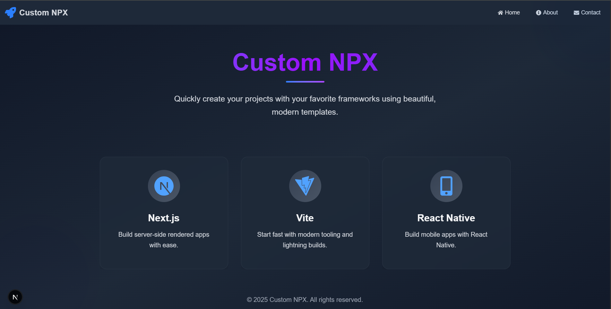
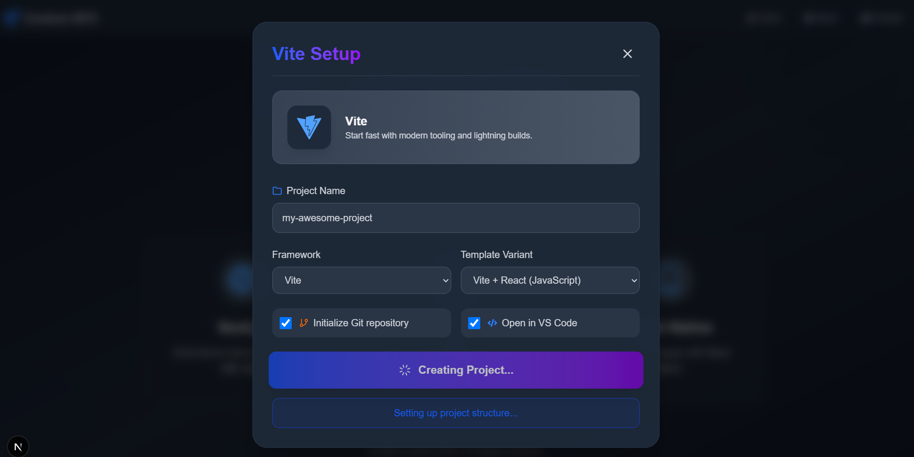

# create-custom

A command-line interface (CLI) tool to quickly scaffold projects with various frameworks and their TypeScript/JavaScript variants.

## Features

- 🚀 Quick project scaffolding
- 📦 Multiple framework support (Next.js, Vite, React Native)
- 🔄 TypeScript and JavaScript variants
- 🛠 Git initialization
- 💻 Automatic VS Code opening
- 🎨 Beautiful UI for template selection

## Supported Templates

- Next.js (TypeScript/JavaScript)
- Vite + Vue (TypeScript/JavaScript)
- React Native (TypeScript/JavaScript)

## Installation

```bash
# Clone the repository
git clone https://github.com/onesmuskipchumba0/custom-npx.git

# Navigate to the project directory
cd create-custom

# Install dependencies
npm install

# Link the package globally
npm link
```

## Usage

Once installed, you can create new projects from anywhere in your terminal:

```bash
create-custom
```

This will:
1. Open a web interface in your default Chrome browser
2. Allow you to select a template and configuration
3. Create your project in the current directory
4. Initialize git (optional)
5. Open VS Code (optional)

## Development

```bash
# Start the development server
npm run dev

# In another terminal, start the API server
cd api
npm run dev
```

## Project Structure

```
create-custom/
├── app/               # Next.js frontend
├── api/              # Express backend
├── bin/              # CLI executable
├── templates/        # Project templates
│   ├── next.js/
│   │   ├── typescript/
│   │   └── javascript/
│   ├── vite/
│   │   ├── vue-ts/
│   │   └── vue-js/
│   └── react-native/
│       ├── typescript/
│       └── javascript/
└── package.json
```

## Requirements

- Node.js 16.x or later
- npm 7.x or later
- Git (optional, for repository initialization)
- Visual Studio Code (optional, for automatic project opening)

## Contributing

1. Fork the repository
2. Create your feature branch (`git checkout -b feature/amazing-feature`)
3. Commit your changes (`git commit -m 'Add some amazing feature'`)
4. Push to the branch (`git push origin feature/amazing-feature`)
5. Open a Pull Request

## Screenshots

### Home Page


### Project Creation


## License

MIT

## Author

Onesmuskipchumba0

## Acknowledgments

- Next.js
- Vite
- React Native
- Express
- Tailwind CSS
